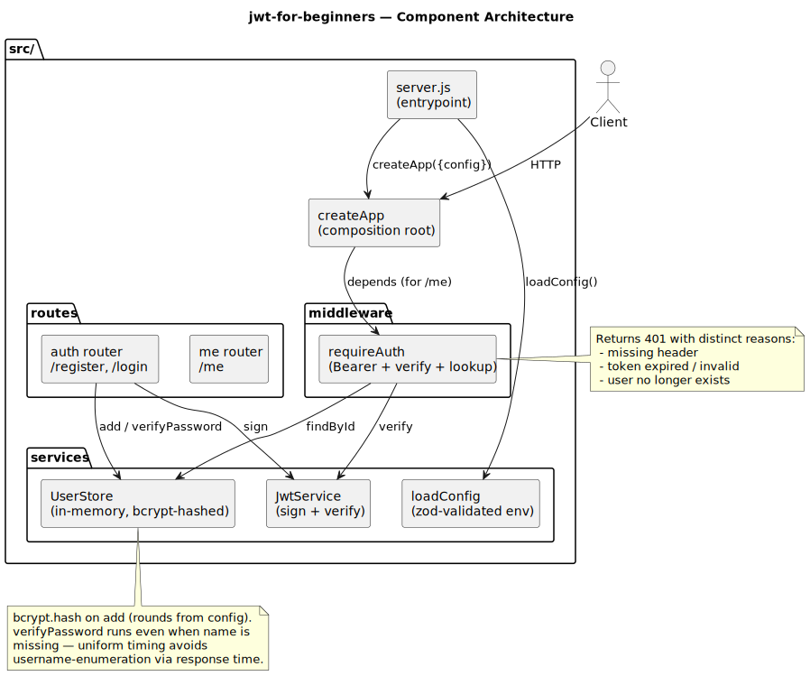
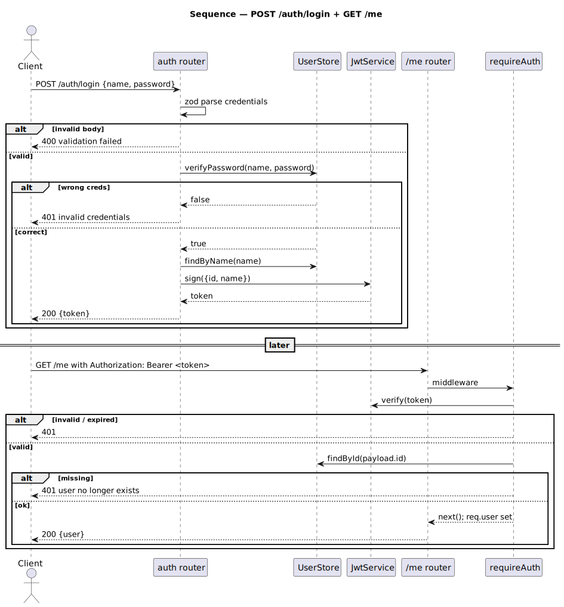
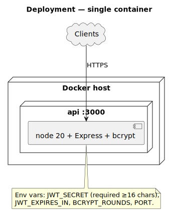

# jwt-for-beginners

Tiny Express + JWT auth backend — register, login, fetch current user.
Modernized into ESM with zod-validated env, bcrypt-hashed passwords, and
real tests.

[](https://github.com/tzone85/jwt-for-beginners/actions/workflows/ci.yml)


## Security alert

The previous `index.js` had a hardcoded JWT-signing secret on line 41:

```
jwtOptions.sec_secretOrKeyProvider = 'thandomncedimini';
```

It's been removed from current code, but it's still in git history forever.
**Rotate the secret if any production system was ever signed with it.**

## Bugs fixed during the port (8)

| File / line (original)   | Bug                                                                                          |
|--------------------------|----------------------------------------------------------------------------------------------|
| `index.js:41`            | Hardcoded JWT secret in source — rotate. Now read from env via zod-validated `JWT_SECRET`.   |
| `index.js:41`            | Typo: `sec_secretOrKeyProvider` instead of `secretOrKey`. Whole passport-jwt strategy was misconfigured. |
| `index.js:47`            | `_.findIndex((users, {id: jwt_payload.id}))` — extra parens make `(users, predicate)` a comma expression evaluating to just the predicate. The call effectively becomes `_.findIndex({id})` → returns -1 → `users[-1]` → undefined → **JWT auth always rejected**. The dead strategy never authenticated anyone. |
| `index.js:28, 33`        | Plaintext passwords in source. Now hashed with `bcrypt` (12 rounds default, configurable).   |
| `index.js:56`            | `passport.use(strategy)` but no route ever called `passport.authenticate('jwt', ...)`. Strategy was dead code. Replaced with explicit `requireAuth` middleware that's actually wired into `/me`. |
| `index.js:64-66`         | `var name = req.body.name; var password = req.body.password;` inside the `if` — hoisted but undefined when body missing. Line 69 then looks up `users.find({name: undefined})`. Now zod-validates before use. |
| `index.js:70-72`         | Sends 401 then **doesn't return** — execution continues to line 74 where `user.password` throws TypeError. Now early-returns with a generic "invalid credentials" message (no username enumeration). |
| `index.js:84`            | Hardcoded port 3000. Now configurable via `PORT`.                                            |

## Architecture







Diagrams are PlantUML under `docs/architecture/*.puml`; rendered SVGs are checked in. Regenerate with `./scripts/render_diagrams.sh`.

## API

| Method | Path             | Auth          | What it does                                                  |
|--------|------------------|---------------|---------------------------------------------------------------|
| GET    | `/`              | none          | Service banner                                                |
| GET    | `/health`        | none          | `{"status": "ok"}`                                            |
| POST   | `/auth/register` | none          | `{name, password}` → 201 with public user                     |
| POST   | `/auth/login`    | none          | `{name, password}` → 200 with `{token}`                       |
| GET    | `/me`            | Bearer JWT    | 200 with `{user: {id, name}}` or 401                          |

## Configuration

| Variable          | Required | Default | Purpose                                          |
|-------------------|----------|---------|--------------------------------------------------|
| `JWT_SECRET`      | yes      | —       | At least 16 chars. Generate: `openssl rand -hex 32` |
| `JWT_EXPIRES_IN`  | no       | `1h`    | Any value accepted by `jsonwebtoken`              |
| `PORT`            | no       | `3000`  | HTTP port                                         |
| `BCRYPT_ROUNDS`   | no       | `12`    | bcrypt cost factor                                |

## Local dev

```
cp .env.example .env       # set a real JWT_SECRET
npm install
npm run dev                # node --watch reload
npm test                   # vitest + coverage
npm run lint
```

Container:
```
docker compose up --build
```

## Tests

| Suite                              | Count   | What                                                                 |
|------------------------------------|---------|----------------------------------------------------------------------|
| `tests/unit/config.test.js`        | 3       | Defaults, overrides, short-secret rejection                          |
| `tests/unit/user-store.test.js`    | 5       | bcrypt-hashes, duplicates, password length, verify roundtrip, projection |
| `tests/unit/jwt-service.test.js`   | 4       | Sign+verify, wrong-secret rejection, expiry, secret required         |
| `tests/unit/routes.test.js`        | 14      | All routes incl. regressions for the find-bug (always-401 /me) and missing-return (TypeError on login) |
| **Total**                          | **26**  | 85% line / 80% branch gate                                           |

## Project layout

```
src/
├── server.js            # entrypoint (loads .env, starts listening)
├── app.js               # composition root, createApp({config | overrides})
├── config.js            # zod-validated env
├── services/
│   ├── jwt-service.js   # sign + verify
│   └── user-store.js    # bcrypt-hashed in-memory store
├── middleware/
│   └── auth.js          # requireAuth — Bearer + verify + lookup
└── routes/
    ├── auth.js          # /register + /login
    └── me.js            # /me
tests/unit/              # vitest + supertest
docs/architecture/       # PlantUML + SVGs
.github/workflows/ci.yml
Dockerfile
docker-compose.yml
```

## License

MIT — see [LICENSE](LICENSE).
